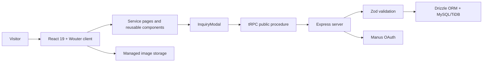

# NextFour Website

NextFour is a high-performance technology company website that presents the team’s strategy, creative, marketing, technology, startup, and CRM implementation services. The experience is built around a dark, high-contrast visual system, animated homepage service carousel, focused service detail pages, and inquiry flows for marketing packages and Trinity CRM demonstrations.

## Product Overview

The website is designed as a public-facing marketing platform. It gives prospective clients a clear path from service discovery to a tailored inquiry, while preserving a consistent interaction model across desktop and mobile devices.

| Area              | What it provides                                                                                                                                       |
| ----------------- | ------------------------------------------------------------------------------------------------------------------------------------------------------ |
| Homepage          | Animated headline, value proposition, looping service carousel, and partner-platform strip.                                                            |
| Service pages     | Dedicated detail pages for Web Design, Branding, Digital Marketing, Business Technology, Startup Support, and CRM Management Systems.                  |
| Digital Marketing | Visual campaign showcase, approved pricing tiers, inclusions dialogs, and package inquiry capture.                                                     |
| CRM Management    | Salesforce, HubSpot, and Pipedrive capability cards; Trinity CRM features, screenshots, onboarding timeline, support accordion, and demo request flow. |
| Inquiry capture   | Public, validated modal forms persisted to the database through tRPC.                                                                                  |

## Screenshot Gallery

These previews show the visual system carried from the animated homepage into key service experiences. The managed images are served from the configured NextFour staging domain rather than committed to the application source tree.

### Homepage


### Web Design & Development


### Digital Marketing


### CRM Management Systems


## Service Routes

| Service                   | Route                           |
| ------------------------- | ------------------------------- |
| Web Design & Development  | `/services/web-design`          |
| Branding & Graphic Design | `/services/branding`            |
| Digital Marketing         | `/services/marketing`           |
| Business Technology       | `/services/business-technology` |
| Startup Support           | `/services/startup-support`     |
| CRM Management Systems    | `/services/crm-management`      |

Each service page includes an accent-aware hero, local quick-jump links, structured content sections, a tailored call to action, and mobile-friendly controls. Page-specific experiences such as pricing dialogs, project carousels, galleries, and accordions remain scoped to their relevant service.

## Technology Stack

| Layer              | Technologies                                                                              |
| ------------------ | ----------------------------------------------------------------------------------------- |
| Frontend           | React 19, TypeScript, Vite, Tailwind CSS 4, Wouter                                        |
| UI and interaction | Radix UI primitives, Lucide icons, Embla Carousel, Framer Motion                          |
| Server             | Express 4 with tRPC 11                                                                    |
| Data               | Drizzle ORM with MySQL/TiDB                                                               |
| Forms              | React Hook Form, Zod, tRPC mutations                                                      |
| Quality            | Vitest, TypeScript compiler checks, GitHub Actions, responsive and interaction validation |

## Repository Structure

```text
client/
  src/
    components/     Reusable site, service, carousel, modal, and UI components
    lib/            Shared content models, navigation data, and client helpers
    pages/          Homepage and service detail routes
    index.css       Global design tokens, responsive styling, and motion rules
server/
  db.ts             Database helpers, including inquiry persistence
  routers.ts        tRPC routers and public inquiry submission procedure
drizzle/
  schema.ts         User and inquiry table definitions
shared/             Shared types and constants
todo.md              Historical implementation checklist
```

## Architecture

The client is a React single-page application that routes service experiences with Wouter. Public inquiry forms call typed tRPC procedures through the Express server, which validates submissions with Zod and persists them through Drizzle. The managed runtime also provides OAuth, storage, and the deployed application entry point.



## Inquiry Workflow

The Digital Marketing package buttons and Trinity CRM **Request a Demo** call to action reuse the `InquiryModal` component. The modal validates the visitor’s details, then calls the public `inquiries.submit` tRPC mutation. The server persists the following fields to the `inquiries` table:

| Field                            | Purpose                                               |
| -------------------------------- | ----------------------------------------------------- |
| `packageName` and `packagePrice` | Identifies the selected package or CRM demo context.  |
| `name`, `email`, and `phone`     | Captures lead contact details.                        |
| `message`                        | Captures the visitor’s requirements.                  |
| `status` and `createdAt`         | Tracks the inquiry lifecycle, beginning at `pending`. |

## Local Development

### Prerequisites

Use a current Node.js runtime and the repository’s configured pnpm version. The project expects the platform-provided environment variables for the database and OAuth integrations; do not commit `.env` files or credentials.

### Setup

```bash
pnpm install
pnpm dev
```

The development command starts the Express/Vite development server. Open the local URL printed in the terminal to review the website.

### Available Commands

| Command        | Description                                                                                      |
| -------------- | ------------------------------------------------------------------------------------------------ |
| `pnpm dev`     | Starts the development server with file watching.                                                |
| `pnpm build`   | Builds the client bundle and production server output.                                           |
| `pnpm start`   | Starts the built production server.                                                              |
| `pnpm test`    | Runs the Vitest suite.                                                                           |
| `pnpm check`   | Runs TypeScript without emitting files.                                                          |
| `pnpm format`  | Formats the repository with Prettier.                                                            |
| `pnpm db:push` | Generates and applies Drizzle migrations. Review generated SQL before applying database changes. |

## Design and Accessibility Principles

The service detail pages use shared design rules so individual service accents still feel like one NextFour experience. Animation is limited to transform and opacity where possible, keyboard focus states match hover feedback, controls retain touch-friendly target sizes, and non-essential motion respects `prefers-reduced-motion`.

Managed image assets are stored outside the source tree and referenced through deployment-safe managed URLs. Avoid adding large media files to `client/public` or `client/src/assets`.

## Testing and Validation

Run both checks before opening a pull request or saving a deployment checkpoint:

```bash
pnpm test
pnpm check
```

The current suite covers the inquiry copy resolver, pricing matrix, marketing navigation, CRM content and platform data, carousel behavior, homepage motion configuration, and shared service-page quick navigation. Responsive validation should additionally confirm the service routes at desktop and mobile widths, especially package dialogs, CRM demo requests, carousel navigation, and anchor links.

### Continuous Integration

The repository includes [`.github/workflows/quality.yml`](.github/workflows/quality.yml). It runs on pull requests targeting `main` and pushes to `main`, installing locked dependencies before checking README/workflow formatting, running Vitest, and running TypeScript without emitting files.

| CI step                               | Command                                                              |
| ------------------------------------- | -------------------------------------------------------------------- |
| Documentation and workflow formatting | `pnpm exec prettier --check README.md .github/workflows/quality.yml` |
| Automated tests                       | `pnpm test`                                                          |
| Static type validation                | `pnpm check`                                                         |

## Contributing

Keep visual and functional changes aligned with the NextFour brand system. Preserve approved service copy, pricing matrices, inquiry behavior, and managed asset URLs unless a change is explicitly requested. Update `todo.md` for every feature or fix, add or adjust Vitest coverage where applicable, and verify the local checks before synchronizing changes to `main`.

## GitHub Workflow

The project is synchronized with [`KreativoDesign/nextfour-homepage`](https://github.com/KreativoDesign/nextfour-homepage). Use focused commits, verify the working tree before pushing, and confirm the remote `main` SHA after significant updates.
